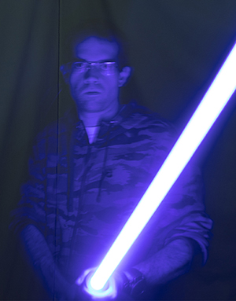
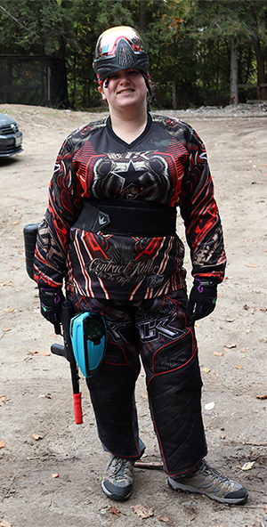

## James Tallon & Brittney Bray's Emerging Web Technologies Assignment

### Who is James?
**Time at Durham College**
- I have attended Durham College in Oshawa a few times before
- I have only successfully completed a program once, which was for General Arts and Science
- Last year I dropped out of Computer Programmer mid-way through second semester, but learned so much along the way

**James' Past and future**
- I have been driving a car since I earned my license when I was 16
- I have never failed a driver test or exam
- I used to weight roughly 360 pounds three years ago, I am now down to 210 and feel great
- I envision myself designing the user interfaces of paintball markers for popular industry leaders like Planet Eclipse or Empire
- The future makes me nervous, but I know that great experiences and a fulfilling life is on the horizon

### What are some of James' hobbies?
**I enjoy playing Pokémon Go**
- I have been playing Pokémon Go on my Android phone since the game’s first release in 2016
- I accumulated 20 million experience reaching the max level of 40 about a year ago
- The games developers have increased the level cap to 50, and in the span of a month I am already level 42 
- I own a Bluetooth enabled, waterproof bracelet that automatically gathers resources in-game when I am not actively playing

**I have been playing paintball for 10+ years**
- I started off not knowing much about the sport
- I used to play at a field in Bowmanville, Ontario for years before it closed
- I own a high-end paintball marker that would double as a car payment if I chose to sell it (expensive gun)
- Note: *This does not include any of my other gear (ie. facemask, playing apparel, headbands, gloves, etc.)*
- My paintball marker has Bluetooth built into it as well

### Who is Brittney?
**Brittney's Past and future**
I used to look at my future and see that I would be a veterinarian running my own practice, being able to help out every animal that came into the clinic. That of course has crashed down since I have noticed how difficult it is being in the veterinary field, it is very much a thankless job when it comes down to it and you do not get enough financially to actually live on your own or give the ability to move out of the house. So I have turned to computers as my next best thing, I never had a fall back career but I love to tinker with things and typically the more frustrating something is the more time I will take to pick it apart. For now I am hoping to move forward with my life and to see what other wonders the world holds instead of keeping my head in a textbook just to barely pass a class. 

### Brittney's Hobbies
- Playing Pokemon GO 
-	Paintball 
-	Reading 
-	Drawing/painting
-	Watching anime 
-	Hanging out with my other half 
-	Dancing like no one’s watching 
-	Reading/gaining facts about animals 
-	Ability to read something once or hear it once and have a 95% chance that I will remember it

### Brittney's Education
-	Animal Care Durham College 
-	Veterinary Office administration Guelph University 
-	Veterinary technician program: I did not complete this program as the workload was very textbook heavy and I do better with hands on tasks.

### Future goals
-	Move out of the house and have my own place to take care of 
-	Get my full drivers license 
-	Have a better understanding of ADHD and learn new ways to cope with it 
-	Enjoy life to the fullest, don’t let fear get in your way
